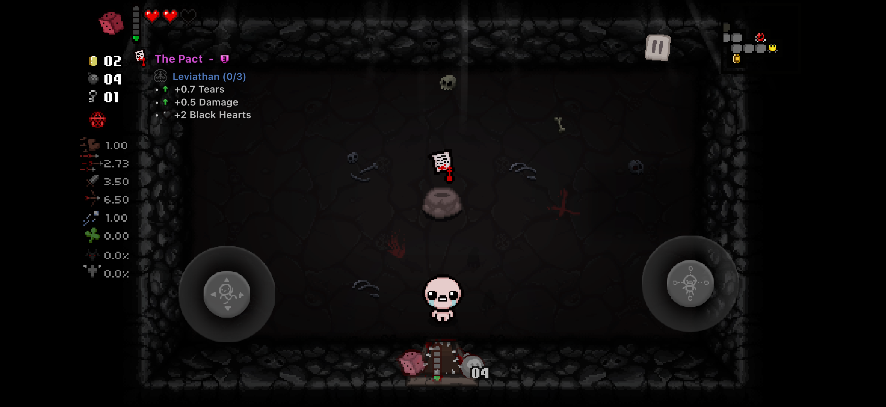

# Isaac External Item Descriptions for iOS

The first publicly released native gameplay mod for **The Binding of Isaac: Repentance on iOS**. It brings External Item Descriptions-style information to the native iOS game without relying on Isaac's desktop Lua mod API.



The same ARM64 implementation supports jailbroken injection, direct app-bundle embedding, and LiveContainer private apps. The dylib itself is portable: ElleKit is used only by the optional jailbreak package as a loader.

## Download

Download the current files from [GitHub Releases](https://github.com/emp0ry/IsaacExternalItemDescriptionsiOS/releases/latest).

| Installation | Release file | Included |
| --- | --- | --- |
| Rootless jailbreak with ElleKit | `IsaacExternalItemDescriptions-rootless.deb` | Dylib, loader filter, descriptions, icons, and transformation data |
| LiveContainer private app | `IsaacExternalItemDescriptions-LiveContainer.framework.zip` | App-specific framework with all required resources |
| Embedded/non-jailbroken app | `IsaacExternalItemDescriptions-Embedded.zip` | Dylib and complete `IsaacEID.bundle` for app-bundle injection |
| Advanced/manual setup | `IsaacExternalItemDescriptions-Full-Build.zip` | Every build format, database, documentation, and checksums |

A standalone `IsaacExternalItemDescriptions.dylib`, `descriptions.json`, and `SHA256SUMS` are also provided. No Isaac IPA or copyrighted game bundle is distributed.

## Features

### Descriptions

- Collectibles and trinkets
- Cards and runes
- Identified pills and horse pills
- Crane Game prizes
- Dice Room effects for all six faces
- The next Sacrifice Room payout with the live step from `1/12` through `12/12`
- Complete Repentance description data for all 20 upstream EID languages, with English fallback for untranslated entries

The overlay tracks the player's position and displays the nearest eligible object. Long descriptions wrap normally and are not cut to a fixed character count.

### Correct knowledge and run state

- Untouched floor cards and runes remain hidden until the game marks them touched or a player holds them in a native pocket slot.
- Pills remain hidden until Isaac's native ItemPool state identifies their effect.
- Curse of the Blind suppresses every collectible description using the native level curse mask. The forced-blind field and question-mark sprite are retained as additional guards.
- Transformation progress is read from the player's native persisted transformation state instead of nearby-item observations.
- The 14 normal transformations use Isaac's persisted native PlayerForm counters, so replaced active items and saved/reloaded runs keep their real progress. Super Bum completion is read from its native merged familiar.
- Native run identity and seed tracking reset learned cards and run-only knowledge when a new run begins.

### Artwork and presentation

- Collectible and trinket artwork is loaded from the installed game.
- Cards use Isaac's native `CardFronts` animation mapping.
- Runes use the correct subtype frame from the attributed original EID card/rune atlas.
- Identified pills use their actual native pill color mapped to the corresponding original EID `Pills` frame.
- Original EID inline symbols, Q0-Q4 quality icons, transformation icons, colors, and description markup are rendered through UIKit.
- The description has no background box and uses compact outlined text designed to remain readable over gameplay.
- Item title, icon, and description disappear together after an item is collected.

### In-game settings

The **EID ⚙** button appears in the bottom-right corner while Isaac is in a menu or a run is paused. It hides automatically during active gameplay. Its settings include:

- All 20 bundled languages
- Horizontal and vertical position
- Scale and opacity
- Independent Name, Icon, Quality, and Description visibility
- Position reset controls
- Dataset/build information and original EID credits

The default overlay position is 140 px from the left and 50 px from the top.

### Pause inventory

While a run is paused, an **EID Items** button appears in the top-left corner and
the **EID ⚙** settings button becomes available in the bottom-right corner.
It opens a scrollable browser containing the player's current collectibles,
active item, trinkets, held cards and runes, identified pills, and progress for
all transformations. Selecting an item closes the browser and renders its full
EID description. The button and browser disappear as soon as gameplay resumes.

## Compatibility

The current native layout supports this App Store build:

| Property | Supported value |
| --- | --- |
| Bundle identifier | `com.Nicalis.Isaac-iOS` |
| Architecture | ARM64 |
| iOS game version | `1.4` |
| Embedded game string | `Repentance v1.7.9b.J754` |
| Mach-O UUID | `F4357753-A25F-30EE-BACF-63709F902895` |
| Description dataset | Standard Repentance `rep` with `ab+` base tables |

Native layouts can change when the game executable changes. An unknown UUID is rejected before entity memory is scanned, so unsupported builds show no overlay instead of using unverified offsets. Repentance+ data is intentionally not used because it does not match the native iOS 1.4 executable.

## Installation

Back up Isaac's application data before replacing or re-signing an installation.

### Rootless jailbreak

Install the release package with a package manager, or from a shell:

```sh
dpkg -i IsaacExternalItemDescriptions-rootless.deb
```

Restart Isaac after installation. The package installs an ElleKit filter for `com.Nicalis.Isaac-iOS`; the loaded dylib does not link against ElleKit, Substrate, libhooker, or another jailbreak runtime.

### LiveContainer private app

1. Extract `IsaacExternalItemDescriptions-LiveContainer.framework.zip` in Files.
2. In LiveContainer, open **Tweaks** and create an app-specific folder such as `IsaacEID`.
3. Open that folder, choose **Import Tweak**, and select `IsaacExternalItemDescriptions.framework`.
4. Long-press Isaac, open **Settings**, and select the new folder under **Tweak Folder**.
5. Keep **Don't Inject TweakLoader** and **Don't Load TweakLoader** disabled.
6. If LiveContainer reports a signing problem, use **Force Sign** for the imported framework.

Isaac must be configured as a private app. Do not place this framework in Global Tweaks. More detail is available in [Installation](docs/INSTALL.md#livecontainer-private-app).

### Embedded/non-jailbroken app

Extract `IsaacExternalItemDescriptions-Embedded.zip` into the app's `Frameworks` directory and add this load command to Isaac's main executable:

```text
@executable_path/Frameworks/IsaacExternalItemDescriptions.dylib
```

The included tool performs the bundle copy and Mach-O modification on a user-supplied decrypted IPA:

```sh
./tools/patch-ipa.sh Isaac.ipa Isaac-EID.ipa
```

The result is unsigned unless `SIGNING_IDENTITY` is supplied. The complete app bundle must be signed after modification. The dylib requires no JIT, executable-memory entitlement, private entitlement, daemon, SSH service, or jailbreak filesystem access.

See [Installation](docs/INSTALL.md) for signing options and limitations.

## Build from source

Requirements:

- macOS and Xcode with an iOS SDK
- Python 3
- `dpkg-deb` for rootless package creation
- A checkout of [wofsauge/External-Item-Descriptions](https://github.com/wofsauge/External-Item-Descriptions) when regenerating attributed data and visual resources

Build and validate every public format:

```sh
make release EID_SOURCE=/path/to/External-Item-Descriptions
```

Useful individual targets:

```sh
make test
make dylib EXTRA_CFLAGS='-Wall -Wextra -Werror'
make package EXTRA_CFLAGS='-Wall -Wextra -Werror'
make livecontainer EXTRA_CFLAGS='-Wall -Wextra -Werror'
make audit
```

`make audit` verifies that the resulting dylib does not reference jailbreak-only libraries. Release files are written to `dist/` and `packages/`.

The description importer combines upstream `ab+` base tables with `rep` overrides. The asset importer builds the inline-icon map and copies the card/pill and transformation resources used by the UIKit renderer.

## How it works

The native iOS game has no desktop Lua mod API. This project locates the supported Isaac executable by UUID, resolves native C++ RTTI for pickup, player, familiar, slot, effect, and grid-spike types, and reads bounded snapshots from its own process.

Those snapshots provide nearby pickup identity, player position, card/rune knowledge, pill knowledge, current inventory, persisted transformation counters, native pause state, level curses, room effects, Sacrifice Room grid state, and run identity. The mod does not patch save data or write into Isaac's native gameplay objects.

Verified offsets and their validation are documented in [Native layout](docs/NATIVE_LAYOUT.md). Device and packaging results are recorded in [Test matrix](docs/TEST_MATRIX.md), and presentation differences are tracked in [EID parity](docs/EID_PARITY.md).

## Limitations

- Only the executable UUID listed above is supported. A game update requires native-layout revalidation.
- This is a native EID implementation, not a general Windows/Linux Lua-mod loader for iOS.
- The in-game overlay currently presents the nearest supported description rather than every object in the room simultaneously.
- Direct embedding requires modifying and signing the application. Re-signing can change the bundle identifier, application container, Keychain groups, and App Store receipt behavior.
- The project does not alter StoreKit, DLC ownership, receipts, or purchase checks.

## Credits and legal

Special thanks to **[wofsauge](https://github.com/wofsauge)** and every [External Item Descriptions](https://github.com/wofsauge/External-Item-Descriptions) contributor for the original mod, descriptions, translations, markup, atlases, and years of maintenance. The original mod is also available through the [Steam Workshop](https://steamcommunity.com/sharedfiles/filedetails/?id=836319872).

The bundled EID-derived descriptions and visual resources are distributed with permission and remain credited to their original authors. Their attribution is preserved in [Third-party notices](THIRD_PARTY_NOTICES.md). Collectible, trinket, and native card artwork is loaded at runtime from the installed game.

This is an unofficial project and is not affiliated with Nicalis, Edmund McMillen, Valve, or the External Item Descriptions maintainers. No game application, DLC, receipt, or purchase bypass is included. The bridge source is available under the [MIT License](LICENSE).
